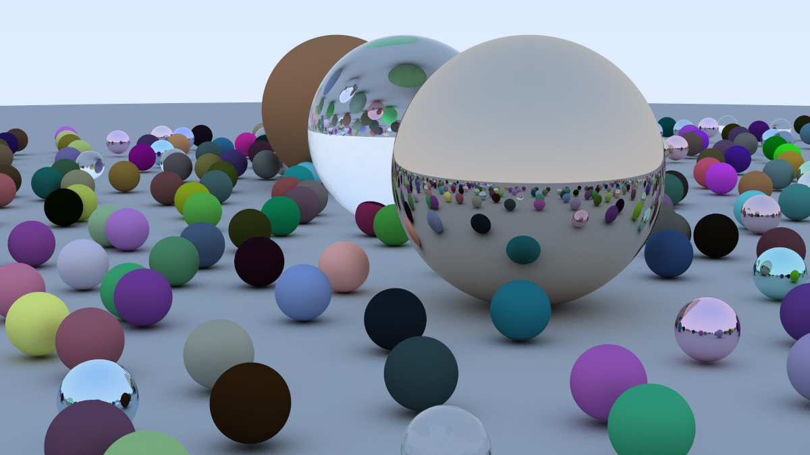

# Java Ray Tracing Engine



## 📖 Overview
This project is a high-performance **Path Tracer** built entirely from scratch in **Java**, without relying on any external graphics libraries (like OpenGL or DirectX).

The goal of this project was to understand the fundamental mathematics and physics behind computer graphics. It simulates light transport by tracing rays from the camera into the scene, calculating intersections, and recursively resolving light bounces to generate photorealistic images with global illumination.

---

## ✨ Key Features
* **High-Performance Architecture:**
    * **Multithreading:** Utilizes Java Streams (`IntStream.parallel`) to run parallel rendering on all available CPU cores.
    * **Bounding Volume Hierarchy (BVH):** Implements an AABB (Axis-Aligned Bounding Box) tree structure to optimize intersection checks from linear $O(N)$ to logarithmic $O(\log N)$ time complexity.
* **Physically Based Rendering (PBR):** Implements realistic light behavior including reflection and refraction.
* **Material System:**
    * **Lambertian (Matte):** Diffuse reflection using random unit sphere scattering.
    * **Metal (Mirror-like):** Specular reflection with adjustable fuzziness/roughness.
    * **Dielectric (Glass/Water):** Real-time refraction using **Snell’s Law** and **Schlick’s Approximation** for Fresnel effects.
* **Antialiasing:** Multisampling per pixel to eliminate jagged edges and reduce noise.
* **Native PNG Output:** Renders directly to `.png` format using Java's `ImageIO` (no external converters needed).
* **Camera System:** Positionable camera with adjustable Field of View (FOV) and depth-of-field (defocus blur) capabilities.
* **Gamma Correction:** Linear-to-gamma color transformation for accurate display output.

---

## 🛠️ Technical Implementation
The engine follows a purely Object-Oriented design pattern:

* **`src/main`**: Handles the entry point, parallel rendering loop, and PNG file output.
* **`src/math`**: Contains the core linear algebra classes (`Vec3`, `Ray`).
* **`src/hittable`**: Defines the geometry and acceleration structures.
    * Includes `BVHNode` and `AABB` for spatial partitioning.
* **`src/material`**: Abstract material system allowing objects to define their own light scattering behavior.

---

### Code Example: Refraction Logic
A snippet demonstrating the implementation of Snell's Law for glass materials:
```java
// From Vec3.java
public static Vec3 refract(Vec3 uv, Vec3 n, double etaiOverEtat) {
    double cosTheta = Math.min(uv.scale(-1).dot(n), 1.0);
    Vec3 rOutPerp = uv.add(n.scale(cosTheta)).scale(etaiOverEtat);
    double rOutParallelVal = -Math.sqrt(Math.abs(1.0 - rOutPerp.lengthSquared()));
    return rOutPerp.add(n.scale(rOutParallelVal));
}
```
---

## 🚀 Getting Started
Prerequisites
Java Development Kit (JDK) 8 or higher.

### Installation & Running
1. Clone the repository:
git clone [https://github.com/DavidSoderqvist/RenderEngine.git](https://github.com/DavidSoderqvist/RenderEngine.git)
cd RenderEngine

2. Compile the source code:
javac -d bin -sourcepath src src/main/Main.java

3. Run the engine:
java -cp bin main.Main

4. View the Output: The engine will generate a high-quality image file (e.g., final_scene_1.png) in the images/ directory.

---

## 🔮 Future Improvements
Texture Mapping: Support for image-based textures on spheres (e.g., Earth maps).

OBJ Loader: Ability to load complex 3D models (triangles/meshes).

Lights: Implement emissive materials to create light sources other than the sky.

---

## 📝 License
This project is open-source and available under the MIT License.